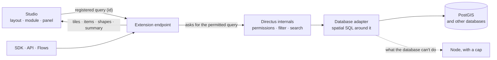

<div align="center">

# Geospatial

**See it. Analyze it. Prove it. Without leaving Directus.**

Maps, spatial analysis and evidence reports for Directus: your Studio, turned into an operational map.

Draw an area, follow a vehicle, count incidents by neighborhood, prove when a truck entered a
geofence. Every spatial operation runs in the database, and every answer respects Directus
permissions.


</div>

---

> [!NOTE]
> **Status: design phase.** The architecture has been planned and reviewed, and the implementation
> plan is written. Nothing is usable yet. This page describes what the extension will do.

## Why it exists

Directus stores geometry well and filters it with four operators: `_intersects`, `_nintersects`,
`_intersects_bbox` and `_nintersects_bbox`. That is where it stops.

| The gap | What it means |
|---|---|
| **No "near me".** | There is no distance query, no radius and no nearest neighbor. Teams write custom endpoints or raw SQL, and re-implement permissions along the way. |
| **No analysis.** | Counting by region, finding hotspots, following a trajectory or measuring an area all happen outside Directus, in another tool, with another copy of the data. |
| **The native map shows, it doesn't analyze.** | It loads 1,000 items per page, clusters in the browser and can't be extended by other extensions. |

**Geospatial closes that gap without leaving Directus.**

## How it works

> The extension never decides who sees what. Directus does.

For every request, the extension asks Directus's own query builder for everything that user may see,
then wraps that query with the spatial SQL and runs it as a single statement.

1. **The Studio registers the question once** (collection, filters, operation, drawn area) and gets a
   short id back.
2. **The map, the list and the summary ask for their part in parallel.** Tiles come from `ST_AsMVT`,
   the list pages with a cursor and the count arrives in two steps: first "10,000+", then the exact
   number.
3. **Each request re-applies the user's permissions.** A user restricted to one region gets the 10
   nearest items *they* can see, never fewer and never someone else's.
4. **What the database can't do runs in Node,** over the permitted items, with a cap and a warning.



## What you can do with it

- **A real map in four places.** A layout on any collection page, a module for operations centers, a
  dashboard panel and a Flow operation. Many layers at once, each with the native filter builder.
- **Thirteen spatial operations.** Radius, by area, measure, nearest, trajectory, corridor, count by
  region, geofence, density grid and hotspots, plus buffer, center and simplify to build the shape the
  next question needs.
- **Chains in one query.** "Schools → 500 m buffer → incidents inside" compiles to a single SQL
  statement, at any volume.
- **Half a million points without a freeze.** Vector tiles built in the database, clustering on the
  server and one request per tile for every visible layer.
- **Trajectories that tell the truth.** Signal gaps are drawn dashed with "30 min · 12 km · at least
  24 km/h", impossible jumps are flagged instead of becoming spikes, and one license plate seen by
  cameras, a patrol car and a GPS tracker becomes one timeline.
- **Geofences you can defend.** Entries, exits and dwell times come from the position history, in
  time order. Each time shows the observed interval and a separate estimate.
- **Evidence reports.** Capture the screen as you work, generate a PDF on the server, and let anyone
  verify it: the QR code opens a page where the PDF is uploaded and checked byte by byte.
- **Integrate from anywhere.** An `/items`-compatible API, a live channel over Server-Sent Events, an
  OpenAPI contract and a typed SDK in the style of the official one.

```ts
const nearby = await client.request(
  geoRadius('stores', { center: [-46.63, -23.55], distance: 2000, fields: ['id', 'name'] }),
);
```

## Permissions come first

- **One rule, no exceptions.** The extension never writes a permission rule of its own. Tiles,
  clusters, counts, exports, live updates and reports all start from the query Directus built for
  that user.
- **Shared links grant nothing.** Whoever opens a shared view sees only what their own permissions
  allow.
- **A report is a document.** Its visibility starts at "only me", and sharing it asks for
  confirmation. Report files live in a folder that regular roles can't read.
- **Personal data stays under your control.** Retention is configurable, a removed report leaves only a
  minimal record, and the two paths that leave your server (address search and basemap tiles) are
  documented, each with an alternative that keeps everything inside.

## Built to protect the database

- **Its own connection pool.** A heavy tile load never blocks login or editing.
- **A priority queue.** Tiles on screen come first, then list pages, then counts and analyses.
- **Timeouts and cancellation end to end.** A tile that scrolled off screen cancels its query in the
  database.
- **Long jobs that survive a restart.** Index builds, large exports, bulk edits and reports run as
  background jobs, with progress, cancel and resume.
- **A cache that can't leak.** It is keyed by the permitted SQL and its parameter values, so users with
  different permissions never share an entry.
- **Nothing changes without the admin.** Spatial indexes, the extension's collections and
  ready-made policies are created only through admin actions that show exactly what will run, SQL
  included. Everything they create is listed, and one admin action removes it.

## Architecture at a glance

| Layer | Choice |
|---|---|
| Package | One Directus bundle: endpoint, hooks, layout, module, panel and Flow operation. It runs outside the sandbox. |
| Engine | TypeScript on Node. Directus's internal query chain (`getAstFromQuery` → `runAst` → `getDBQuery`) behind a version adapter, checked at startup |
| Databases | PostGIS as the reference; one adapter per database; a capability matrix detected at startup |
| Map | MapLibre with deck.gl interleaved, both loaded on demand; Terra Draw for drawing; GeographicLib for measurements |
| Tiles | Mapbox Vector Tiles from `ST_AsMVT`, composite per request, cached per layer |
| Live | Server-Sent Events in ticks; `LISTEN/NOTIFY` triggers for writes made outside Directus |
| Storage | The extension's data in Directus collections (`geospatial_*`); temporary state in memory or Redis |
| API | Two styles, `/items`-compatible and registered queries, under `/geospatial`, with an OpenAPI contract |
| SDK | `directus-geospatial-sdk`, typed commands used with `client.request` |
| Reports | PDF built on the server, SHA-256 content and file hashes, optional PAdES signature |
| Tests | Real Directus 11 and 12 and real databases in containers; permission parity with `/items`; 90% coverage |

Full detail, with the reasoning behind each choice, in [`docs/arquitetura.md`](docs/arquitetura.md).

## Databases

| Database | Support |
|---|---|
| PostgreSQL + PostGIS | Everything. This is the reference. |
| CockroachDB | Through the Postgres adapter; the gaps will be confirmed by the tests. |
| MySQL, MariaDB | What the database supports runs there, and the rest runs in Node with a cap. |
| SQL Server, Oracle | Adapters with their own spatial functions. |
| SQLite + SpatiaLite | Development and tests. |

## Status

- [x] Architecture designed and documented (decisions D-001 to D-039)
- [x] Directus internals verified in the source code (version 12.4.1)
- [x] Design reviewed against the glossary and the decisions
- [x] Implementation plan, in phases
- [ ] Foundation: permitted queries, adapters, tiles and the capability matrix
- [ ] Studio surfaces, operations, time and movement
- [ ] Evidence reports, starting with the geofence template
- [ ] First public release on npm and the Directus Marketplace

## Documentation

The design documents are currently in Portuguese. English user, admin, API and SDK documentation
will ship with the first release.

| Document | Contents |
|---|---|
| [`CONTEXT.md`](CONTEXT.md) | Domain glossary, Portuguese and English |
| [`docs/arquitetura.md`](docs/arquitetura.md) | The full architecture |
| [`docs/decisoes.md`](docs/decisoes.md) | Every decision, with the reason and the alternatives ruled out |
| [`docs/verificacoes.md`](docs/verificacoes.md) | Facts verified in the source code of Directus, PostGIS and the other tools, and pending checks |
| [`docs/implementacao/`](docs/implementacao/README.md) | The implementation plan, phase by phase |

## Author

**Harrison Sanches** · [@HarrisonSanches](https://github.com/HarrisonSanches)

MIT licensed. An independent community project, not affiliated with or endorsed by Directus.
