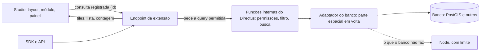

# Arquitetura

> O desenho da extensão `directus-extension-geospatial`: o que ela faz e como.
> Os motivos das escolhas estão em [decisoes.md](decisoes.md) (D-0xx), os fatos conferidos em ferramentas de terceiros em [verificacoes.md](verificacoes.md) (V-xx, e as pendências P-xx), e os termos em [CONTEXT.md](../CONTEXT.md).
> Os levantamentos de mercado são de setembro de 2026. Os fatos sobre o Directus foram conferidos no código da versão 12.4.1.

## 1. Objetivo

Criar uma extensão para o Directus, publicada para a comunidade, que transforme o Studio num **painel operacional para visualizar e analisar dados geométricos**. As operações espaciais rodam no banco de dados (PostGIS como implementação de referência) e ficam disponíveis pela interface no Studio (layout, módulo e painel), pela API, pelo SDK e pelos Flows do Directus. O que o usuário analisa também pode virar um relatório em PDF, com valor de evidência (7.9).

Não é um playground nem um console de SQL. É um painel de operação com um catálogo rico de funcionalidades geoespaciais, acionadas por interações simples: clicar no mapa, desenhar um polígono, informar uma distância.

## 2. Princípios

- **Extensão completa e viável.** Não há recorte de "primeira versão": se uma funcionalidade pode atender vários contextos, ela entra. A ordem de construção só aparece no plano de implementação.
- **Otimização e melhores práticas de mercado** em cada decisão de arquitetura.
- **PostGIS é a referência.** Toda funcionalidade é pensada primeiro para o PostGIS. Os outros bancos oferecem o que conseguirem (7.4).
- **Permissões do Directus acima de tudo** (regra de ouro, seção 5).
- **Resultado honesto.** Resultado parcial ou limitado sempre avisa que é parcial.
- **Nada muda no banco nem nas permissões sem o admin ver e confirmar.** Índices, coleções da extensão e políticas prontas são criados por ação do admin, que vê antes o que vai mudar (o SQL, as coleções ou as permissões).

## 3. Origem da ideia

### Ideias avaliadas e descartadas

| Ideia | Por que ficou de fora |
|---|---|
| Timeline dos dados de uma coleção | Já existem: painel estilo Gantt da Directus Labs, layout de timeline da Devix e layout de calendário nativo. |
| "Time Machine" (histórico de revisões, viagem no tempo, desfazer em lote) | Nenhum pedido direto encontrado. O core vem melhorando a tela de revisões (modal de comparação em nov/2025, comparação com a revisão anterior em fev/2026) e o roadmap tem "histórico de revisões persistente" em fase de descoberta. |
| Mapa genérico com deck.gl | O autor avaliou que esse espaço já está atendido (extensão directus-map-grid). |
| Operação de Flow para WhatsApp; gerador de códigos únicos | Simples demais para o objetivo. |
| Tree view para itens aninhados | Já resolvido por um layout da Directus Labs. |
| Pedidos mais votados do roadmap (renomear coleções e campos, views do banco, busca em campos relacionais) | Exigem mudança no core; não cabem numa extensão. |

### Por que geoespacial

- O Directus oferece só quatro operadores geoespaciais de filtro: `_intersects`, `_nintersects`, `_intersects_bbox` e `_nintersects_bbox`. Não há consulta por distância ou raio, medição, agregação espacial nem análise.
- Uma discussão no GitHub de 2025 (directus/directus#25123), pedindo um operador `_within`, aponta que quem precisa de proximidade acaba escrevendo endpoints próprios ou SQL cru.
- O pedido de suporte a PostGIS no roadmap oficial tem poucos votos (8), mas não encontramos nenhuma extensão cobrindo o tema. Existe um template público de Directus + PostGIS mantido e atualizado (Railway), sinal de que a combinação é usada.
- É o nicho de maior domínio do autor, o que torna a extensão difícil de copiar.

## 4. Arquitetura geral

### 4.1 Visão geral

1. **Motor no servidor.** Extensão de API (endpoint) que roda fora do sandbox e executa as operações no banco. Tem um adaptador por banco e usa o Node para completar o que o banco não faz (7.4). Usa conexões, fila e cache próprios (7.1).
2. **Interface no Studio.** São três formas com o mesmo núcleo (mapa, ferramentas de desenho e lista de resultados), todas com várias camadas (7.3):
   - **Layout de coleção:** aparece no seletor de layouts da página da coleção. Aproveita a busca, os filtros, os bookmarks, as ações em lote e a exportação da página, e guarda o próprio estado nas opções do layout.
   - **Módulo:** tem um item próprio na barra lateral, que o admin ativa. É o painel operacional com várias coleções ao mesmo tempo.
   - **Painel** para os dashboards (Insights).
3. **SDK.** Pacote separado (`directus-geospatial-sdk`), tipado e no estilo do SDK oficial, com comandos como `withinRadius()` e `countByPolygon()` (7.8).
4. **Operação de Flow e relatórios.** Uma operação "Geo" para as automações (7.8) e os relatórios em PDF (7.9), sobre o mesmo motor.

**Consulta registrada.** A interface registra a consulta uma vez (filtro, busca, operação e geometria desenhada) e recebe um id curto. Tiles, lista e contagem são pedidos por esse id. A permissão é aplicada em cada pedido com a identidade de quem pede, então repassar o id a outra pessoa não vaza nada. O mesmo id serve para cache, consultas salvas e compartilhamento. O registro fica em memória ou no Redis (7.8).

**Resposta no formato do `/items`.** A ideia continua: aceitar os mesmos parâmetros (filter, fields, sort, limit etc.) mais os geoespaciais, e devolver no mesmo formato. Entra no desenho da API (7.8).

Uma extensão não consegue adicionar operadores novos ao sistema de filtros nativo. A integração de verdade ao ItemsService seria um PR no core (como a proposta do `_within`), um possível passo futuro fora do escopo da extensão.

### 4.2 Relação com o mapa nativo

- O Directus já tem um layout de mapa, feito com MapLibre. Ele busca pelo `/items`, 1000 itens por página. Filtra pela área visível com `_intersects_bbox`, agrupa pontos no navegador, seleciona por retângulo, abre o item com um clique e busca endereços quando há chave do Mapbox. Não faz raio, medição nem mais próximos, não deixa desenhar um polígono para filtrar e não agrega nada.
- **Posicionamento:** o nativo mostra, a extensão analisa.
- **Não dá para estender o nativo.** O componente dele é interno, e o MapLibre do Studio não é compartilhado com extensões. Por isso a extensão traz a própria base (carregar pela área visível, agrupar, clicar, selecionar) e o próprio MapLibre.
- **Limites de um layout de extensão, e como lidamos com eles:**
  - Ele aparece em toda coleção, inclusive Files, Users e seletores de relação, e não há como escondê-lo. Quando a coleção não tem campo de geometria, mostramos um aviso.
  - Ele não escreve no filtro da página. A geometria desenhada não chega à exportação nem às ações em lote nativas; ela passa pela seleção ou por um download próprio.
  - Só o dono atualiza um bookmark, e o preset comum é salvo a cada movimento do mapa, como no nativo.

## 5. Modelo de permissões

**Regra de ouro:** quem decide o que o usuário recebe é sempre a lógica de permissões do próprio Directus. A extensão nunca escreve regra de permissão própria.

### Como funciona

1. O Studio ou o SDK chama o endpoint com a sessão ou o token do usuário, sem privilégio extra.
2. A extensão pede às funções internas do Directus, que são a mesma cadeia usada pelo `ItemsService`, a query do que esse usuário pode ver na coleção. Essa query já vem com o filtro de permissão (o item passa se bater com pelo menos uma política), o filtro da página, a busca e as regras por campo. O Directus a monta sem executar.
3. O adaptador do banco envolve essa query com a parte espacial (tile, distância, mais próximos, agrupamento, junção com outra coleção) e executa tudo num SQL só.

### Exemplo

A usuária Maria tem o papel "Operador Zona Sul" e só pode ler ocorrências com `regiao = sul`. Ela pede as 10 ocorrências mais próximas de um ponto. O Directus monta a query "ocorrências com `regiao = sul`", a extensão a ordena pela distância até o ponto e pega as 10 primeiras. As 10 vêm completas, e todas são visíveis para a Maria.

No fluxo do handoff, o SQL rodava primeiro e o `ItemsService` filtrava depois com `_in`. Se 4 das 10 fossem da zona norte, a Maria receberia 6, e não as 10 mais próximas que ela pode ver.

### Por que esta opção

A alternativa era usar só a API pública, ou seja, traduzir cada operação em filtros nativos e chamadas ao `ItemsService`. As permissões ficariam exatas e o contrato estável, mas parte do catálogo ficaria de fora:
- Tiles e agregações em zoom baixo exigiriam colunas pré-calculadas na coleção do usuário.
- Ordenar um resultado grande por distância não escalaria.
- Focos sobre grandes volumes seriam inviáveis.
- Os mais próximos exigiriam várias consultas.

### Proteções

1. Só um módulo da extensão toca nos internos do Directus, com um adaptador por versão.
2. Ao subir, a extensão confere se os internos são os esperados. Se não forem, ela desliga as operações afetadas e avisa, para não arriscar vazar dados.
3. Testes de integração com Directus v11 e v12 reais e um papel restrito provam que a extensão devolve os mesmos itens que o `/items` (7.4).
4. Um canário roda os testes contra cada nova versão do Directus (7.4).

### Perdas aceitas

- Os hooks `items.read` de outras extensões não rodam sobre tiles e agregações. O `items.query` é respeitado.
- Os valores saem crus do banco, sem a formatação do `PayloadService`.

### O que esta opção resolveu do handoff

- **"Mais próximos" com menos de N itens:** os N vêm completos, porque a ordenação roda sobre a query já filtrada.
- **Listas `_in` enormes:** não existem mais.
- **Sem permissão no campo de geometria:** a extensão devolve erro de permissão, como o `/items`.
- **Operações entre duas coleções:** basta juntar as duas queries permitidas.
- **Atalho para admin:** não precisa ser escrito, porque a query do admin já vem sem filtro de permissão.

## 6. Catálogo de operações

As referências PostGIS são a implementação de referência. Nos outros bancos, cada operação roda no banco, roda no Node com limite, ou não aparece (7.4). As medições são sempre em metros (7.6).

### Básico

| # | Operação | O que o usuário faz | O que aparece no mapa | Referência PostGIS |
|---|---|---|---|---|
| 1 | Raio | Clica num ponto e informa a distância | Círculo desenhado, itens de dentro destacados, lista com a distância de cada um | `ST_Buffer` (desenho), `ST_DWithin` (seleção) |
| 2 | Área desenhada | Desenha um polígono livre | Itens dentro do polígono | `ST_Within`, `ST_Contains` |
| 3 | Medir | Seleciona dois itens, ou um polígono | Linha entre os itens com a distância; área e perímetro do polígono | `ST_Distance`, `ST_MakeLine`, `ST_Area`, `ST_Perimeter` |
| 4 | Mais próximos | Clica num ponto e escolhe N | Os N itens mais próximos ligados ao ponto por linhas | Operador `<->` (KNN) |

### Intermediário

| # | Operação | O que o usuário faz | O que aparece no mapa | Referência PostGIS |
|---|---|---|---|---|
| 5 | Trajeto | Escolhe itens com data (ex.: pontos GPS) | Linha ordenada no tempo, com a distância total | `ST_MakeLine` ordenado, `ST_Length` |
| 6 | Corredor | Escolhe uma linha (ex.: rodovia) e uma largura | Faixa ao longo da linha e os itens dentro dela | `ST_Buffer` em linha, `ST_Intersects` |
| 7 | Contagem por região | Escolhe uma coleção de polígonos (ex.: bairros) | Mapa colorido pela quantidade de itens em cada região | Junção espacial + contagem |

### Avançado

| # | Operação | O que o usuário faz | O que aparece no mapa | Referência PostGIS |
|---|---|---|---|---|
| 8 | Grade de densidade | Escolhe o tamanho da célula | Hexágonos coloridos pela concentração de pontos | `ST_HexagonGrid`, `ST_SquareGrid` (PostGIS 3.1+) |
| 9 | Focos | Define os parâmetros de agrupamento | Grupos de pontos próximos com o contorno de cada um | `ST_ClusterDBSCAN`, `ST_ConcaveHull` |

**Fora de escopo por ora:** rotas por ruas reais e isócronas (dependem do pgRouting) e diagramas de Voronoi (pouco usados em operação).

**Outras funções para expandir o catálogo no futuro:** `ST_Centroid`, `ST_Union`, `ST_Intersection`, `ST_Difference`, `ST_ConvexHull`, `ST_Simplify`, `ST_Extent`, `ST_ClusterKMeans`, `ST_LineLocatePoint`.

## 7. Desenho por tema

### 7.1 Grandes volumes de dados

#### Como os dados chegam ao mapa: tiles vetoriais

- O mapa é dividido em quadrados, com uma grade para cada zoom, e pede só os quadrados visíveis no zoom atual.
- O endpoint monta cada quadrado no banco com `ST_AsMVT`, em volta da query permitida (seção 5). O quadrado traz só o que cai nele, recortado e simplificado para aquele zoom, num formato binário compacto.
- Cada quadrado aparece assim que chega, então o carregamento é progressivo por área. Quando o usuário move o mapa, só os quadrados novos são pedidos.
- Os tiles são pedidos pelo id da consulta registrada (4.1).
- Um único pedido por tile traz todas as camadas visíveis (7.3, grupo 1).

**Por que não somar páginas no mapa**, que era a ideia do handoff:
- Com 500 mil resultados, o navegador acabaria guardando dezenas de MB de GeoJSON.
- O mapa reprocessaria tudo o que acumulou a cada nova página.
- As páginas não acompanham a área que o usuário está olhando.
- Em zoom baixo, 500 mil pontos empilhados viram uma mancha.

#### Zoom baixo: agrupamento no servidor

- Dentro de cada tile, o servidor divide o quadrado em células de tamanho fixo na tela (por exemplo, 60 × 60 px), e a mesma regra vale em todos os tiles.
- Uma célula com um item manda o próprio item, que continua clicável. Uma célula com vários manda um grupo com a contagem, na posição média dos itens, junto com o retângulo que os envolve. Clicar no grupo aproxima o mapa até esse retângulo.
- Não existe zoom mínimo fixo: a regra se ajusta à densidade. No mesmo zoom, o centro da cidade aparece em grupos e a zona rural, em itens soltos. É o comportamento do supercluster, só que no servidor e para qualquer volume.
- Há dois estilos a partir dos mesmos tiles: círculos com o número ou mapa de calor, com o peso dado pela contagem.
- As contagens vêm da query permitida, então cada usuário só conta o que pode ver.
- Linhas e polígonos nunca são agrupados, só simplificados conforme o zoom (tolerância de cerca de 1 pixel). Um trajeto mantém a forma e, no zoom de rua, mostra exatamente as ruas percorridas.
- Cada camada configura três coisas: se agrupa ou não, o tamanho da célula e o zoom a partir do qual tudo aparece solto (como o `clusterMaxZoom` do supercluster). Esse último é necessário para pontos de GPS densos.

#### Lista e contagem

- A lista segue a ordem natural da operação, e o usuário pode trocá-la:

  | Operação | Ordem natural |
  |---|---|
  | Raio, mais próximos | Distância até o centro |
  | Corredor | Posição ao longo da linha |
  | Trajeto | Tempo |
  | Área desenhada | A ordenação escolhida na página |
  | Contagem por região, grade, focos | Maior contagem primeiro |

- **Paginação por cursor**, e não por número de página. Com número de página, o banco lê e descarta tudo o que vem antes, e a lista se desloca quando entram itens novos. Com cursor, o banco vai direto ao ponto pelo índice, na mesma velocidade em qualquer profundidade.
- **Rolagem virtual.** A lista desenha só as linhas visíveis e busca as próximas pelo cursor conforme o usuário rola.
- **Contagem em dois tempos.** Primeiro, uma contagem rápida que para em 10.001 e mostra "10.000+" (o limite é configurável). Depois, a contagem exata roda em segundo plano, com tempo limite; se ele estourar, fica o "10.000+". A lista e o mapa não esperam pela contagem.
- **Durante o carregamento**, aparecem um resumo no topo ("Raio de 2 km · 10.000+ itens" e depois "512.340 itens"), linhas provisórias na lista e uma barra fina de progresso no mapa.
- Mapa, lista e contagem usam o mesmo id de consulta, então respondem à mesma pergunta.

#### Proteção do banco

1. **Tempo máximo para toda consulta**, configurável por tipo (tile, página da lista, contagem exata e análise).
   - Um tile que estoura o tempo volta marcado, e o mapa o mostra hachurado com "área pesada: aproxime ou filtre".
   - Acima do zoom em que tudo aparece solto, um tile com itens demais (por exemplo, mais de 50 mil) volta agrupado mesmo assim.
2. **Cancelamento de ponta a ponta.** O MapLibre cancela os tiles que saíram da tela, e a interface cancela a lista e a contagem quando a operação muda. No servidor, um pedido cancelado também cancela a consulta no banco.
3. **Conexões próprias e fila (padrão bulkhead).** A extensão tem um pool de conexões separado do pool do Directus, para que uma carga pesada de tiles não trave o login e a edição.
   - Uma fila com prioridade: tiles da tela, depois páginas da lista, depois contagens e análises.
   - Um limite por usuário.
   - Opcionalmente, o pool pode apontar para uma réplica de leitura.
4. **Cache.**
   - A chave junta o SQL montado pelo Directus, a versão da coleção e o tile. Como o SQL já traz a permissão, quem tem exatamente as mesmas permissões compartilha o cache e quem tem permissões diferentes nunca recebe o dado do outro.
   - O Directus gera o SQL de forma determinística. Se um dia ele variar, o efeito é só perder o cache, nunca vazar dado. Um teste automatizado cobre isso.
   - Toda gravação feita pelo Directus muda a versão da coleção. As gravações feitas fora dele são detectadas como no grupo 5 do 7.3 (gatilho no Postgres ou campo de data de atualização), e um tempo de vida curto fica como rede de segurança.
   - O cache fica em memória ou no Redis, quando o Directus usa Redis. No navegador, `Cache-Control: private`.
5. **Painel de saúde para o admin**, o mesmo do índice (7.6): tempo dos tiles, tamanho da fila, taxa de acerto do cache e consultas lentas, cada uma com o id da consulta.

#### Renderização

- **MapLibre na base:** mapas de fundo, tiles vetoriais, estilos por dado, grupos, mapa de calor e destaque.
- **deck.gl intercalado** no mesmo canvas, pelo `MapboxOverlay`: trajeto animado (`TripsLayer`), muitos objetos se movendo em tempo real, 3D e agregações na placa de vídeo. Os nomes de ruas continuam por cima dos dados.
- **Leaflet e OpenLayers ficaram de fora.** O Leaflet não usa WebGL para desenhar dados, e o OpenLayers não traria ganho aqui e ficaria diferente do mapa nativo.
- **A extensão traz as próprias bibliotecas.** Isso a deixa independente da versão do MapLibre que o Directus usa. O requisito é WebGL2, o mesmo do nativo.
- **Carregamento sob demanda.** O Studio baixa um arquivo único com todas as extensões ao iniciar. Para não pesar para quem nunca abre um mapa, o MapLibre só é baixado quando um mapa abre, e o deck.gl só quando uma camada precisa dele. Isso exige um build próprio, porque o build padrão do SDK junta tudo num arquivo só. A viabilidade será confirmada num teste ([pendências em verificacoes.md](verificacoes.md#pendências)).

### 7.2 Navegação item a item pelo teclado

- **Ordem.** A seta segue a ordem da lista, que é a ordem natural da operação (7.1): no corredor, a posição ao longo da linha; no trajeto, o tempo; no raio, a distância.
- **Carregamento.** Quando o usuário chega a uns 10 itens do fim do que já foi carregado, a próxima página é pedida pelo cursor. Na prática, a seta não espera o servidor, e é possível percorrer resultados enormes. A rolagem virtual mantém visível na lista o item atual.
- **Onde as setas navegam.** Só quando a lista de resultados está em foco. Com o foco no mapa, as setas continuam movendo o mapa (padrão do MapLibre, importante para acessibilidade), e a extensão não toma as teclas do Studio.
- **Teclas:**

  | Tecla | Ação |
  |---|---|
  | ↓ ou → | Próximo item |
  | ↑ ou ← | Item anterior |
  | Home / End | Primeiro / último |
  | Enter | Abre o drawer |
  | Espaço | Marca ou desmarca na seleção |
  | Esc | Sai da navegação |
  | ? | Mostra os atalhos |

- **O mapa a cada passo:**
  - O item atual é desenhado numa camada de destaque, por cima dos tiles, com a geometria que veio na lista. Ele aparece sozinho mesmo dentro de um grupo.
  - A câmera só se move quando o item sai da área central da tela, com um deslize curto. Com a tecla segurada, ela pula sem animação, para não acumular movimentos.
  - A opção "seguir" mantém o item sempre no centro, o que é útil no trajeto.
  - O zoom não muda.
- **Detalhes no painel lateral.** O template de exibição do item, mais os dados da operação:
  - no raio e nos mais próximos, a distância;
  - no corredor, a posição ao longo da linha ("km 12,4 de 38");
  - no trajeto, o horário, a velocidade e o tempo desde o ponto anterior.

  No trajeto e no corredor, o trecho da linha já percorrido muda de cor.
- **No trajeto**, os pontos por onde a seta passa vêm da lista, com posição e horário exatos. A simplificação da linha não interfere.
- **Acessibilidade do teclado:**
  - A lista segue o padrão *listbox* do WAI-ARIA, e o leitor de tela anuncia cada item.
  - O resumo é anunciado numa região ao vivo.
  - O foco fica sempre visível.
  - Seleção e destaque não dependem só de cor: usam também contorno e forma.
  - Com "reduzir movimento" ligado no sistema, a câmera pula sem animar.

  O resto da acessibilidade fica no grupo 6 do 7.3.

### 7.3 Interações

#### Grupo 1: camadas

- **O que é uma camada:** uma coleção (com o campo de geometria e o filtro dela), o resultado de uma operação ou as formas desenhadas pelo usuário. Cada camada tem estilo, agrupamento e contagem próprios.
- **Em cada forma:**
  - **Layout:** a primeira camada é a coleção da página, presa aos filtros, à busca e à seleção da página. O usuário pode adicionar outras coleções como camadas extras (por exemplo, bairros por baixo das ocorrências), cada uma com o seu filtro. Tudo fica nas opções do layout, e o bookmark restaura.
  - **Módulo:** as camadas são livres. A visão (camadas, filtros, mapa de fundo e enquadramento) é salva numa coleção da própria extensão, e as permissões do Directus nessa coleção decidem quem vê e quem edita cada visão. As coleções da extensão estão no 7.8.
  - **Painel:** as camadas ficam nas opções do painel, e as variáveis globais do dashboard podem alimentar os filtros. Uma variável "região", por exemplo, filtra todas as camadas.
- **O filtro de cada camada é o construtor de filtros nativo do Directus.** Assim a operação espacial se combina com status, datas e o resto.
- **Painel de camadas (legenda).**
  - Ligar e desligar, reordenar arrastando e ajustar a opacidade.
  - Estilo: cor por campo, tamanho por campo numérico, ícone.
  - As três configurações de agrupamento (7.1) e a contagem de cada camada.
  - Quando o campo já tem cores configuradas no Directus, como nas opções de um status, a camada usa as mesmas cores e a legenda sai pronta.
- **Permissão por camada.** Cada camada usa a permissão do usuário naquela coleção. Numa visão compartilhada com uma coleção que o usuário não pode ler, essa camada aparece com o aviso "sem acesso" e o resto funciona.
- **Um pedido por tile para todas as camadas.** Com uma requisição por camada, 5 camadas × 12 tiles dariam 60 pedidos, e em HTTP/1.1 o navegador só faz umas 6 conexões simultâneas por servidor. Por isso o mapa pede um tile por quadrado com todas as camadas visíveis. O servidor monta e guarda no cache cada camada separadamente e junta tudo num só tile, já que o MVT aceita várias camadas. Ligar ou desligar uma camada não invalida o cache das outras. É a ideia de fontes compostas do servidor de tiles Martin.

#### Grupo 2: seleção e item

**Seleção sincronizada**
- **Uma seleção só.** Mapa e lista compartilham a mesma seleção. No layout, ela é a própria seleção da página da coleção, então as ações em lote nativas (editar, arquivar, apagar) funcionam sobre o que foi selecionado no mapa.
- **Formas de selecionar:** clique com Shift ou Ctrl para acrescentar ou tirar um item; retângulo ou laço (polígono livre) para uma área; e "selecionar todo o resultado".
- **A seleção por área é uma consulta ao servidor**, não o que está desenhado na tela. Por isso inclui os itens que estão dentro de grupos.
- **Hover sincronizado** entre lista e mapa. A lista só rola sozinha no clique, nunca no hover.
- **Destaque.** Os itens selecionados vão para a camada de destaque e aparecem mesmo dentro de um grupo. O grupo que contém itens selecionados ganha um anel.
- **Limite.** A seleção é uma lista de ids enviada no corpo das ações em lote do Directus, e esse corpo tem limite padrão de 1 MB. Acima de um limite (por exemplo, 10 mil itens), a extensão avisa e não seleciona tudo. As ações sobre o resultado inteiro estão no grupo 4.

**Abrir o item**
- **Clique.** O clique num item, no mapa ou na lista, abre o drawer de edição nativo por cima do mapa, sem sair da tela. Ctrl/Cmd + clique abre a página do item numa nova aba, como no nativo. O comportamento do clique é configurável por visão.
- **Salvar.** O drawer nativo não salva sozinho: a extensão grava pela API, com a permissão do usuário. Sem permissão de edição, o drawer abre só para leitura.
- **Atualização.** Depois de salvar, o item aparece atualizado na hora: a gravação muda a versão da coleção, e o tile antigo sai do cache. Se a posição foi mudada no mapa do drawer, o item já aparece no lugar novo.
- **Hover** mostra um cartão pequeno com o template de exibição da coleção, usando o mesmo componente do Directus.
- **Vários itens no mesmo lugar:** o clique abre uma lista curta para escolher qual abrir.
- A navegação pelo teclado está no 7.2.

#### Grupo 3: desenho, medição e busca

**Desenho: Terra Draw**
- **Por que ele.** Tem licença MIT, adaptador oficial para o MapLibre e não depende de um motor de mapa específico. Como a extensão traz o próprio MapLibre, a versão escolhida precisa ser uma que o adaptador suporte ([pendências em verificacoes.md](verificacoes.md#pendências)).
- **Os modos cobrem o catálogo:**
  - círculo geodésico para o raio;
  - polígono e desenho livre para a área desenhada e o laço (em tela de toque, só polígono);
  - linha para o corredor e para a medição;
  - retângulo para a seleção;
  - modo de seleção para editar depois de desenhar: mover vértices, arrastar, redimensionar, acrescentar ou tirar vértices.
- **Encaixe.** Linha e polígono encaixam em vértices e trechos de outras formas, e uma regra própria encaixa nos itens das camadas visíveis.
- **O mapbox-gl-draw, que o Directus usa, ficou de fora:** foi feito para o Mapbox e não tem círculo, retângulo nem desenho livre sem plugins de terceiros.

**Medição ao vivo**
- **Enquanto desenha, o usuário vê:**
  - numa linha, o trecho atual e o total;
  - num polígono, a área e o perímetro;
  - num círculo, o raio e a área.

  Os valores aparecem como rótulos junto da forma e num resumo no painel.
- **O mesmo cálculo do servidor.** O navegador usa a GeographicLib, a mesma biblioteca que o PostGIS usa para medir `geography` sobre o elipsoide, então o número ao vivo bate com o número final do servidor. O Turf, que calcula sobre uma esfera, poderia errar até cerca de 0,5%.
- **Unidades:** métricas por padrão, trocando conforme a grandeza, com opção de unidades imperiais. A formatação segue o idioma.
- **Validação.** A interface barra formas grandes demais já no desenho, com a validação de área do Terra Draw. A proteção de verdade fica no servidor (7.8).

**Busca**
- **Uma caixa, três tipos de resultado:**
  - coordenadas (graus decimais, graus/minutos/segundos, UTM), sempre disponíveis;
  - itens das camadas visíveis, pela busca nativa do Directus, com as permissões de cada coleção;
  - endereços, pelo provedor configurado.
- **Provedores de endereço:** Mapbox, quando o Directus tem chave; Nominatim público, dentro da política; serviço próprio (Nominatim, Photon, Pelias); provedores comerciais com chave.
- **Padrão sem chave do Mapbox: Nominatim público no modo permitido.**
  - A busca roda ao apertar Enter; buscar enquanto se digita é proibido.
  - No máximo 1 pedido por segundo para a instalação inteira.
  - Resultados em cache, aplicação identificada e atribuição visível.

  A documentação indica um serviço próprio ou pago para uso intenso, e o admin pode trocar o provedor ou desligar a busca de endereços.
- **Toda busca de endereço passa pelo endpoint da extensão.** Assim a extensão aplica a política de cada provedor para a instalação inteira, guarda no servidor as chaves que não podem ir ao navegador, alcança serviços em `http` na intranet e identifica a aplicação.

#### Grupo 4: encadear e salvar

**Encadear operações**
- **Tipos de resultado.** Cada operação produz um de três:
  - itens (raio, área, mais próximos, corredor);
  - formas (círculo, faixa, contorno de foco, área desenhada);
  - resumos (contagem por região, grade, focos).
- **Encadear é usar um resultado como entrada da próxima operação.** Exemplos:
  - escolas → faixa de 500 m → ocorrências dentro da faixa;
  - focos de ocorrências → câmeras dentro de cada foco;
  - raio de 5 km → contagem por bairro só dentro do raio.
- **A cadeia inteira vira uma consulta só.** As etapas são compostas num único SQL, e cada coleção entra pela sua query permitida (seção 5). Nenhuma lista de ids é guardada no meio do caminho, por isso funciona com qualquer volume. O id da consulta cobre a cadeia toda.
- **Na interface:**
  - cada resultado tem a ação "usar como entrada", com as operações que fazem sentido para o tipo dele;
  - um trilho no topo mostra a cadeia ("Escolas → Faixa 500 m → Ocorrências");
  - cada etapa pode ser editada ou removida, e o resto é recalculado.
- **Limites:**
  - profundidade máxima configurável (por exemplo, 5 etapas);
  - a cadeia só é oferecida se todas as etapas estiverem disponíveis no banco;
  - se alguma etapa rodar no Node com limite, o resultado final avisa.

**Salvar um resultado como item**
- **O que pode ser salvo:** uma forma (faixa, contorno de foco, área desenhada, linha do trajeto) vira um item novo de uma coleção.
- **Coleções oferecidas:** só as coleções em que o usuário pode criar itens e que têm campo de geometria compatível (polígono para áreas, linha para trajetos, ponto para centros).
- **Como salva:** abre o drawer nativo de criação com a geometria preenchida, e o usuário completa os outros campos. Salvar passa pela API com a permissão dele, então validações, campos obrigatórios, hooks e Flows funcionam como em qualquer criação.
- **Conversão:** a geometria é convertida para o tipo e o SRID do campo. Formas com vértices demais podem ser simplificadas antes, e o usuário vê o resultado.
- **Vários de uma vez** (por exemplo, todos os focos): tem limite, e a confirmação mostra quantos itens serão criados.

**Ações sobre o resultado inteiro**
- **O que dá para fazer:** editar, arquivar ou apagar todo o resultado de uma consulta, sem o limite de 10 mil da seleção.
- **Confirmação:**
  - mostra a contagem exata ("isto vai editar 512.340 itens");
  - para apagar acima de um limite, o usuário digita o número para confirmar;
  - a edição reaproveita o drawer de edição em lote do Directus, no modo `stageOnSave`, que devolve as mudanças sem salvar.
- **Execução:** roda em segundo plano, em lotes, pelo `ItemsService` com a permissão do usuário, e cada lote passa pelas mesmas regras, validações e hooks de uma ação normal. Tem progresso e cancelamento, e o usuário recebe uma notificação do Directus no fim.
- **Permissão:** só aparecem as ações que o usuário pode fazer na coleção.

**Consultas salvas e compartilhamento**
- **Layout:** os bookmarks nativos guardam tudo.
- **Módulo:** as visões ficam na coleção da extensão, com dono e visibilidade.
- **Posição do mapa na URL,** como faz o OpenStreetMap (zoom, latitude, longitude). Colar o endereço abre o mapa no mesmo lugar, sem salvar nada.
- **Botão "Compartilhar":** grava o conteúdo da consulta na coleção da extensão e gera um link curto. Assim o link não expira quando o id temporário sai do cache, e o dono pode revogá-lo apagando o registro.
- **Um link nunca dá acesso a nada:** quem abre vê só o que as próprias permissões deixam.

**Exportação**
- **Formatos, cada um para um público:**
  - GeoJSON, para desenvolvedores e ferramentas web;
  - CSV, para planilhas: pontos em colunas de latitude e longitude, outras geometrias em WKT;
  - KML, para Google Earth e Google My Maps;
  - GeoPackage, o padrão aberto (OGC) para QGIS e ArcGIS.
- **Sistema de coordenadas:** 4326 por padrão, ou o SRID da coluna (por exemplo, SIRGAS 2000 / UTM).
- **Colunas:** os campos escolhidos na camada, mais os valores calculados (distância, posição na linha, tempo desde o ponto anterior).
- **Streaming:** o banco entrega as linhas aos poucos, sem encher a memória do servidor.
- **Tamanho:** uma exportação pequena baixa na hora. A grande segue o padrão do Directus: roda em segundo plano, o arquivo vai para Arquivos e o usuário recebe uma notificação quando fica pronta ou quando falha.

#### Grupo 5: tempo

**Linha do tempo** (para camadas com campo de data)
- **Janela de tempo.** Um controle deslizante com início e fim filtra as camadas pelo campo de data.
  - Acima dele, um histograma mostra quantos itens há em cada intervalo, calculado no servidor sobre a query permitida.
  - Mudar a janela muda a consulta e atualiza os tiles; com o BRIN no campo de data (7.6), isso é rápido.
  - Há atalhos (última hora, 24 h, 7 dias) e um intervalo livre.
- **Playback.** O botão play move a janela no tempo, com velocidade ajustável e repetição.
  - Pedir tiles a cada quadro seria pesado demais. Por isso a extensão carrega uma única vez os dados do intervalo e da área visível, num formato compacto, e a animação roda na placa de vídeo com o deck.gl, como no Kepler.gl.
  - Há um limite de volume (por exemplo, 2 milhões de pontos), com aviso.
- **Trajetos.** A `TripsLayer` anima cada veículo com um rastro que se apaga, com um relógio do instante e a opção "seguir". Ao pausar, o usuário navega ponto a ponto pelo teclado (7.2).
- **Fuso horário.** Os horários aparecem como no Studio, respeitando o tipo do campo (com ou sem fuso).

**Tempo real**
- **Opção "ao vivo" por camada,** com a hora da última atualização e um aviso quando os dados param de chegar.
- **O WebSocket do Directus não é o caminho principal**, por três motivos:
  - vem desligado por padrão;
  - lê cada evento de novo, com a permissão, para cada inscrito: 1.000 veículos por segundo com 50 pessoas olhando dariam 50 mil leituras por segundo;
  - só enxerga gravações feitas pelo Directus.
- **Canal próprio por SSE (Server-Sent Events).** É uma conexão HTTP comum por onde o servidor envia as atualizações. Não depende de configuração, usa a mesma autenticação e passa por proxies. Uma conexão por mapa leva todas as camadas ao vivo.
- **Atualização em pulsos.** A cada pulso (por exemplo, 1 s), o servidor junta o que mudou e envia de uma vez, com uma consulta por query permitida. Quem tem as mesmas permissões compartilha a mesma consulta.
- **Permissão a cada pulso.** O lote sai da query permitida de cada usuário. Uma viatura que entra na zona norte some do mapa da Maria.
- **Movimento suave.** O deck.gl leva cada objeto da posição antiga até a nova ao longo do pulso.

**Gravações feitas fora do Directus** (por exemplo, o serviço que recebe os GPS gravando direto no banco)
1. **Pelo Directus:** os hooks da extensão avisam o cache e o tempo real, para tudo o que passa pelo Directus.
2. **Gatilho no banco (Postgres):** avisa a extensão a cada gravação, venha de onde vier (`LISTEN/NOTIFY`). É criado por ação do admin, com o SQL à vista.
3. **Campo de data de atualização (qualquer banco):** a extensão verifica periodicamente o que mudou desde o último pulso, usando um campo escolhido na camada. Não enxerga exclusões, e a extensão sugere um índice no campo.

A mesma detecção invalida o cache (7.1). Ela também entra na matriz de capacidades: o gatilho existe só no Postgres, e nos outros bancos vale o campo de data.

#### Grupo 6: acabamento

**Tema**
- **Variáveis de tema.** A extensão usa as variáveis de tema do Directus (`--theme--*`), como o mapa nativo. Assim segue o modo claro ou escuro de cada usuário e os temas personalizados. As variáveis que mudaram de nome entre v11 e v12 funcionam nas duas versões.
- **Mapa de fundo.** Acompanha o tema (7.7).
- **Cores dos dados:**
  - paletas testadas nos dois fundos, com contraste suficiente e seguras para daltonismo;
  - contagens (mapa de calor, contagem por região, grade) com paletas sequenciais de percepção uniforme, como a viridis;
  - as cores configuradas nos campos têm prioridade.

**Responsividade**
- **Telas pequenas:** a lista lateral vira uma gaveta que sobe da parte de baixo da tela, e a barra de ferramentas vira um menu compacto.
- **Toque:**
  - pinça para zoom;
  - o primeiro toque abre o cartão e o segundo abre o item;
  - toque longo abre as ações;
  - no lugar do desenho livre entra o polígono;
  - alvos de toque de pelo menos 44 × 44 px.
- **Painel pequeno no dashboard:** modo compacto (mapa e legenda, sem ferramentas), com o botão "abrir no módulo", que leva a mesma visão para a tela cheia.

**Idiomas**
- **pt-BR e inglês,** com arquivos de tradução separados e abertos a contribuições da comunidade.
- **O idioma segue o do usuário no Directus.** Os textos da extensão entram no mesmo sistema de tradução do Studio.
- **Nomes de coleções e campos** aparecem com as traduções configuradas pelo admin.
- **Números, datas, distâncias e áreas** são formatados conforme o idioma.

**Acessibilidade**
- **Meta: WCAG 2.2 nível AA,** o padrão de mercado e a referência de leis como a LBI e o European Accessibility Act.
- **O mapa sempre tem uma alternativa acessível: a lista.** Tudo o que aparece no mapa está na lista de resultados, que o leitor de tela lê (7.2). A legenda é texto, não só cor.
- **Toda operação pode ser feita sem desenhar:**
  - o centro do raio pode vir de um endereço buscado, de coordenadas digitadas ou de um item selecionado, e a distância é digitada;
  - a área pode ser um polígono que já existe, como um bairro.

  Isso serve a quem usa teclado ou leitor de tela e também a quem precisa de precisão.
- **Requisitos gerais:**
  - contraste mínimo de 4,5:1 para textos e de 3:1 para controles;
  - rótulo em todo botão de ferramenta;
  - foco controlado nos drawers e popups;
  - interface funcionando com zoom de 200% no navegador.
- **Verificação:** o axe-core roda nos testes de ponta a ponta (Playwright), e antes de cada release há um teste manual com leitor de tela (NVDA e VoiceOver).
- **Teclado, região ao vivo e "reduzir movimento"** estão no 7.2.

### 7.4 Suporte a vários bancos

#### Arquitetura

- **Um adaptador por banco, todos com a mesma interface.** Cada operação é implementada no SQL do banco sempre que ele permitir.
- **A permissão continua vindo do Directus** (seção 5). O Directus monta a query permitida no dialeto do banco, e o adaptador só escreve a parte espacial em volta. A regra de ouro vale em todos os bancos.
- **O que o banco não faz, o Node completa**, sempre sobre os itens já permitidos, com um limite de volume (por exemplo, 50 mil itens) e um aviso quando o limite for atingido:
  - distâncias e áreas com a GeographicLib, o mesmo cálculo do PostGIS, e as outras operações geométricas com Turf;
  - tiles montados a partir das linhas nos bancos sem `ST_AsMVT`, com `geojson-vt` e `vt-pbf`;
  - focos (DBSCAN) em JavaScript.

  O agrupamento por células é aritmética sobre as coordenadas e roda em SQL em qualquer banco.
- **Matriz de capacidades.** Na inicialização, a extensão detecta o banco, a versão e as extensões instaladas (por exemplo, a versão do PostGIS ou a presença da SpatiaLite). Para cada operação, registra um de quatro níveis: no banco com índice, no banco sem índice, no Node com limite ou indisponível. A interface, a API e os testes leem dessa matriz.
- **A saúde do índice (7.6) vale para todos os bancos**, com o índice de cada um: GiST no Postgres, `SPATIAL INDEX` no MySQL e no MariaDB, índice com caixa limite no SQL Server, metadados mais índice espacial no Oracle.

#### O que cada banco oferece hoje (fatos em [verificacoes.md](verificacoes.md); lacunas confirmadas nos testes)

- **PostgreSQL + PostGIS:** tudo, pois é a referência.
- **CockroachDB:** o Directus usa o mesmo helper do Postgres. Tem os tipos e boa parte das funções do PostGIS. As lacunas para o nosso catálogo, como `ST_AsMVT` e os mais próximos usando o índice, serão confirmadas.
- **MySQL:** o Directus grava a geometria sem SRID, e a coluna fica sem o atributo SRID. Nessa situação, o otimizador ignora os índices espaciais, e o índice ainda exige `NOT NULL`. A correção a testar é marcar a coluna como `NOT NULL SRID 0` e criar o índice.
- **MariaDB:** passa pelo mesmo helper do MySQL. O índice espacial exige `NOT NULL`. As distâncias são planas, e metros só com `ST_Distance_Sphere`.
- **SQL Server:** a coluna é `geometry` (plano) com SRID 4326. Para medir em metros, os itens são convertidos para `geography` depois do filtro por caixa.
- **Oracle:** a coluna é `sdo_geometry` com SRID 4326 (geodésico, em metros), e há busca de mais próximos com índice (`SDO_NN`). O filtro nativo do Directus usa um operador que provavelmente exige índice espacial; isso será confirmado.
- **SQLite:** só tem geometria se a SpatiaLite já estiver carregada. Na prática, é banco de desenvolvimento e de testes.

#### Como lidar com as diferenças

- **A matriz varia por banco e por versão.** Mesmo no Postgres, a grade hexagonal exige PostGIS 3.1 ou mais novo.
- **O usuário comum vê cada operação em um de três estados:**
  - disponível;
  - disponível com limite: roda no Node, e quando o limite afeta um resultado, o resultado avisa;
  - indisponível: a operação não aparece.
- **O admin vê a matriz completa no painel de saúde**, com o motivo de cada item indisponível ou limitado e como liberá-lo (instalar o PostGIS, atualizar a versão, criar o índice).
- **Visões salvas que usam algo indisponível** (bookmark, painel de dashboard, link compartilhado) abrem com um aviso, e o resto delas funciona.
- **API e SDK.** `GET /geospatial/capabilities` devolve a matriz. Chamar uma operação indisponível devolve um erro com código próprio e o motivo, no formato de erro do Directus. O SDK expõe as duas coisas.
- **Detectar de novo.** Um botão no painel de saúde refaz a matriz sem reiniciar, por exemplo depois de instalar o PostGIS.

#### Testes

1. **Testes de contrato:** a mesma suíte para todos os bancos.
   - Um conjunto fixo de dados é carregado pela API do Directus, para que fique gravado do jeito que o Directus grava em cada banco.
   - Cada operação declarada na matriz tem um resultado esperado, com tolerância para distâncias.
   - Uma operação não declarada precisa devolver o erro de indisponível.
2. **Paridade de permissão com o `/items`**, usando um papel restrito.
   - Quando um filtro nativo faz a mesma pergunta (a área desenhada equivale ao `_intersects`), os IDs precisam ser idênticos.
   - Quando não faz, como no raio, o teste calcula a resposta certa: busca os itens permitidos pelo `/items` e calcula com a GeographicLib.
3. **Ambiente real, sem mock de banco.** Directus v11 e v12 de verdade e bancos em containers, com as mesmas imagens dos testes do Directus. Cada banco roda na versão mínima suportada e na mais nova; as mínimas serão definidas no 7.5.

**Quando cada teste roda:**
- Em todo pull request: PostGIS e SQLite nas duas versões do Directus, mais os testes unitários.
- Toda noite e antes de cada release: a matriz inteira.
- Um canário roda contra cada nova versão do Directus.

**Fora dos testes que bloqueiam:**
- Os benchmarks rodam sob demanda, e os números vão para [verificacoes.md](verificacoes.md).
- A interface tem testes de ponta a ponta (Playwright) com PostGIS, nas três formas: o mapa abre, os tiles chegam e o clique abre o drawer. Esses testes também rodam a verificação de acessibilidade do axe-core.
- Antes de cada release, há um teste manual com leitor de tela (NVDA e VoiceOver).

#### Cobertura

- **Código novo ou alterado:** pelo menos 90% em todo pull request. A cobertura total funciona como uma catraca: pode subir, nunca cair.
- **Motor** (adaptadores, permissões, tiles, consulta registrada): 90% de linhas e 90% de ramificações.
- **Cobertura somada entre os bancos.** Os relatórios de todos os bancos são somados, e um pull request que mexe num adaptador também roda o teste daquele banco.
- **Interface.** A lógica (composables, stores, cálculos, estado das ferramentas) fica em módulos testáveis, com 90%. A camada fina que só desenha no WebGL é coberta pelos testes de ponta a ponta, sem meta de linhas.
- **Teste de mutação** (Stryker) no módulo de permissões, toda noite, com meta de 90%.
- A cobertura precisa vir de testes de comportamento. Teste escrito só para bater a meta não conta.

### 7.5 Publicação e compatibilidade

#### Checagem de mercado (23/09/2026)

- **npm:** nenhuma extensão faz análise espacial no servidor. As de mapa são de visualização:
  - `@devix-tecnologia/directus-extension-mapgrid`, um layout com mapa e grade (o "map-grid" citado na seção 3), com última versão em março de 2025;
  - uma interface de mapa para relações (`o2m-map`);
  - um mapa L7 de 2023.
- **O nome `directus-extension-geo` já existe no npm,** numa extensão de dados de países, estados e cidades.
- **Directus Cloud:** não há confirmação oficial de PostGIS. A documentação da Supabase diz que o Cloud ainda não permite ligar um banco externo, e extensões customizadas só existem no Enterprise. O público é quem hospeda o próprio Directus; no Cloud, só o Enterprise, depois de confirmar o PostGIS com a Directus.

#### Versões suportadas

- **Directus:** a versão principal atual e a última minor da anterior, hoje v12 e v11.17 (`host: ^11.17.0 || ^12.0.0`). Quando sair o v13, o v11 deixa de ser suportado.
  - O motivo é que as funções internas usadas na opção A mudam entre versões, e suportar minors antigas multiplicaria os adaptadores. O canário testa cada versão nova.
  - O Marketplace só oferece a última versão de cada extensão, então todo release precisa valer para as duas versões suportadas; do contrário, quem está no v11 perderia a instalação pelo Marketplace.
  - O CLI do SDK ainda gera `host: ^10.10.0`, então o valor é ajustado à mão.
- **Bancos:** a mesma política do Directus, que é suportar as versões LTS. A mínima de cada banco é a mais antiga que o fabricante ainda suporta na data do release. A matriz de testes roda a mínima e a mais nova, e a lista concreta é revista a cada release.
- **PostGIS:** a mais antiga que o projeto PostGIS ainda mantém, nunca abaixo da 3.1 (a primeira com a grade hexagonal).
- **Navegador:** WebGL2, como o mapa nativo.

#### Instalação

- **Por que não é um clique com a configuração padrão:** o endpoint acessa o banco e não pode rodar em sandbox, e o Marketplace, por padrão (`MARKETPLACE_TRUST=sandbox`), só lista e instala extensões de API em sandbox.
- **Três caminhos documentados:**
  1. **Marketplace:** o admin define `MARKETPLACE_TRUST=all`, e a extensão aparece e instala pelo Studio. É o mais simples, mas libera qualquer extensão fora do sandbox, e a documentação explica esse risco.
  2. **Imagem Docker:** um Dockerfile pronto, em etapas porque a imagem do v12 não tem npm, que acrescenta a extensão à imagem oficial. É o caminho recomendado para produção, porque é versionado e reproduzível.
  3. **Pasta de extensões:** o build da release no GitHub, montado em `EXTENSIONS_PATH`.
- **Exemplo completo com `docker compose`:** Directus, PostGIS, Redis e a extensão. É o mesmo usado na demo.
- **Um pacote só.** Uma parte em sandbox não teria motor sem o endpoint, então não vale separar.
- **Formato do pacote:** um bundle com endpoint, hooks (cache e tempo real), layout, módulo, painel e a operação de Flow. O SDK é publicado como pacote separado, para quem o usa nos próprios front-ends.
- **Requisitos do Marketplace:** publicar no npm com a palavra-chave `directus-extension`, preencher `name`, `version`, `directus:extension.type` e `directus:extension.host`, e incluir a pasta `dist`. O README vira a página da extensão, e as imagens só carregam de `raw.githubusercontent.com`.

#### Confiança

Uma extensão fora do sandbox tem acesso total ao banco. Para quem instala poder confiar nela:
- publicação no npm com *provenance* (assinada pelo GitHub Actions);
- SBOM (lista de dependências) a cada release;
- `SECURITY.md` com canal para reportar falhas;
- CHANGELOG e versionamento semântico;
- documentação que lista exatamente o que a extensão acessa: tabelas, funções internas do Directus e variáveis de ambiente.

#### Nome e licença

- **Pacote:** `directus-extension-geospatial`, sem escopo, que aparece no Marketplace como "Geospatial". O nome descreve o assunto (dados geoespaciais), então cobre também os relatórios (7.9).
- **Prefixos:** `/geospatial` na API e `geospatial_` nas coleções da extensão. Um prefixo genérico como `/geo` poderia colidir com a extensão `directus-extension-geo`, que já existe.
- **SDK:** pacote separado, `directus-geospatial-sdk`, sem o prefixo `directus-extension-`, porque não é uma extensão: ele roda nos front-ends de quem usa.
- **Licença:** MIT, a mesma das extensões da Directus Labs e do mapgrid. Se um dia houver suporte pago ou uma versão "pro", isso funciona como um pacote separado.

#### Documentação

- **Idiomas:** inglês como principal (o Marketplace é global) e o guia do usuário também em pt-BR.
- **README:** vira a página no Marketplace, com o que a extensão faz, GIFs, os três caminhos de instalação e um início rápido.
- **Site de documentação**, com uma versão por release:
  - guia do usuário;
  - guia do admin (instalação, índices, permissões, Redis, CSP, provedores, variáveis de ambiente e tudo o que a extensão acessa);
  - referências da API (gerada do OpenAPI) e do SDK (gerada dos tipos);
  - a operação de Flow e os relatórios;
  - a matriz de capacidades por banco, gerada a partir dos testes de contrato;
  - contribuição, CHANGELOG e SECURITY.
- **Capturas de tela** geradas automaticamente a partir da demo.

#### Demo e dataset

- **Demo local:** um `docker compose` sobe Directus, PostGIS, Redis, a extensão e os dados.
- **Dataset**, criado por um gerador que carrega os dados pela API do Directus, como nos testes:
  - uma frota com trajetos de GPS sobre ruas reais, mais um simulador de posições ao vivo;
  - ocorrências com categoria, status e data, num volume configurável (10 mil na demo, 100 milhões no benchmark);
  - bairros e vias de dados abertos, com as atribuições exigidas pelas licenças (a ODbL do OpenStreetMap, por exemplo).
- **Cidade:** São Paulo, com uma coleção em SIRGAS 2000 / UTM 23S, para mostrar o suporte a SRID que o mapa nativo não tem.

#### Demo pública

Fica num servidor próprio do autor, com volume moderado (alguns milhões de pontos). A estimativa, a confirmar medindo, é de 4 GB de RAM e 2 vCPUs. O benchmark de 100 milhões roda em outra máquina.

- **O Studio exige login.** O papel público do Directus vale para a API, não para o Studio.
- **Studio com usuários de demonstração**, cujas senhas ficam publicadas na tela de login:
  - "Operador": usa o layout, o módulo e o painel e edita itens da demo, sem acesso a configurações, Flows, usuários ou upload;
  - "Maria, Operador Zona Sul": igual ao Operador, mas só vê a zona sul, para mostrar a regra de ouro na prática.
- **Nunca um admin.** Um admin permitiria instalar extensões, mudar configurações, criar Flows que fazem requisições externas e subir arquivos. As funções de admin aparecem na documentação.
- **API pública só de leitura,** com limite por IP. Os exemplos da documentação apontam para ela e funcionam de verdade.
- **Proteções:**
  - o banco é restaurado a partir de uma cópia limpa periodicamente;
  - HTTPS com Let's Encrypt;
  - limitador de pedidos do Directus ligado, além dos limites da extensão;
  - cadastro público, e-mails e upload desligados para os papéis da demo.
- **Instalação pela imagem Docker,** para a demo testar a própria receita.
- **O simulador ao vivo** roda sem parar.
- **Aviso na tela de login:** dados fictícios, apagados periodicamente, com as atribuições dos mapas.

### 7.6 Metros, SRID e índices

**O problema.** Em SRID 4326, as coordenadas estão em graus, e as funções sobre `geometry` calculam em graus. Converter para `geography` dá o resultado em metros, mas impede o uso do índice espacial da coluna.

- **Metros sem perder o índice: filtro em dois estágios.** Primeiro, uma caixa no SRID da coluna, que usa o índice e descarta quase tudo. Depois, o teste exato em metros com `geography`, só no que sobrou. O tamanho da caixa é calculado a partir do raio e da latitude, para ela sempre conter o círculo. O resultado é exato e o esquema não muda.
- **Mais próximos:** o `<->` acha os candidatos pelo índice, e o `geography` dá a ordem exata.
- **Medições** (distância, área, perímetro, comprimento) sempre em `geography`.
- **Qualquer SRID.** O motor lê o SRID da coluna, converte a entrada do usuário (que chega em 4326) para esse SRID, para usar o índice, e devolve o resultado em 4326 para o mapa. Colunas `geography` também são suportadas. O Directus não trata SRID, então a extensão funciona onde o mapa nativo falha, por exemplo com SIRGAS 2000 / UTM 23S (EPSG:31983).
- **Saúde do índice.**
  - O Directus nunca cria índice espacial: a opção "Index" do campo cria um B-tree. A extensão detecta quando falta um índice espacial em cada coluna de geometria.
  - Sem o índice, todos os usuários veem um aviso que explica o impacto: cada operação e cada movimento do mapa varrem a tabela inteira, o que pode levar segundos e pesa o banco para todos.
  - O admin tem um botão que mostra o SQL exato (`CREATE INDEX CONCURRENTLY ... USING gist`) e pede confirmação. A confirmação mostra o tamanho da tabela e, quando ela é grande, sugere rodar fora do horário de pico.
  - A criação roda em segundo plano, fora da requisição HTTP, com barra de progresso (`pg_stat_progress_create_index`).
  - Se falhar, a extensão detecta o índice inválido e oferece apagar e tentar de novo.
  - Os tempos reais de criação serão medidos no dataset de demonstração.
- **BRIN nos campos de data.** Ele guarda o menor e o maior valor de cada bloco da tabela. Com dados que chegam em ordem de tempo (GPS, telemetria), um filtro por período pula quase toda a tabela, e o índice ocupa poucos MB. A extensão o sugere quando a correlação do campo é alta (`pg_stats.correlation`), no mesmo fluxo do GiST.
- **Tabelas particionadas auxiliares: avaliadas e não adotadas como arquitetura.**
  - O Directus não enxerga tabelas particionadas, por isso a ideia era a extensão manter uma cópia particionada só para as leituras espaciais.
  - Motivos para não adotar: dobra o disco, exige sincronização e manutenção de partições, e o Directus continua lento na tabela principal. O principal: pela seção 5, toda consulta na auxiliar precisaria voltar à principal para conferir a permissão, e isso anula o ganho justamente nas consultas pesadas.
  - A ideia fica como hipótese para o benchmark ([pendências em verificacoes.md](verificacoes.md#pendências)). Se o ganho medido justificar, ela vira um acelerador opcional por coleção, ligado pelo admin.

### 7.7 Mapas de fundo

O mapa tem vários mapas de fundo, com um seletor, organizado em três grupos:

1. **Do Directus.** A mesma lista do mapa nativo, com os mesmos nomes: OpenStreetMap (sempre), Mapbox (quando há chave) e os mapas cadastrados pelo admin nas configurações (tipos `raster`, `tile` e `style`). Satélite, Esri, MapTiler e Google entram por aqui, com a chave de cada provedor e respeitando os termos de cada um. O OpenStreetMap usa o endereço atual (`tile.openstreetmap.org`) e mostra sempre a atribuição.
2. **Da extensão, sem chave: OpenFreeMap.** Estilos Positron (claro), Dark (escuro), Liberty e Bright. É gratuito, sem limite de acessos, sem cadastro e com uso comercial permitido. Os estilos claro e escuro acompanham o tema do Studio.
3. **PMTiles no próprio Directus.** O admin guarda em Arquivos um arquivo `.pmtiles` com a região, e o mapa o lê pelo `/assets`, aos pedaços. Os estilos claro e escuro vêm do Protomaps, e a extensão serve as fontes e os ícones do mapa. Funciona sem internet, o que importa para centrais de operação em redes fechadas.

- **Padrão de fábrica:** OpenFreeMap, claro ou escuro conforme o tema. O admin pode definir outro padrão, inclusive o OpenStreetMap, e cada visão guarda o mapa escolhido.
- **Por que o padrão não é o OpenStreetMap:** os servidores de tiles do OSM são mantidos por voluntários, e a política de uso permite bloquear o acesso sem aviso se o uso prejudicar o serviço. Além disso, uma imagem raster fica borrada no zoom e não tem versão escura.
- **Riscos:** o OpenFreeMap vive de doações. Por isso a documentação recomenda o PMTiles ou um provedor pago para produção crítica.
- **Rede:** a CSP padrão do Directus libera os endereços `https` e os workers que o mapa usa. Servidores de tiles em `http` simples, comuns em intranet, ficam bloqueados; o PMTiles evita esse problema.

### 7.8 Pontos que surgiram na discussão

#### Armazenamento da extensão

| O quê | Onde |
|---|---|
| Estado do layout | Presets e bookmarks do Directus |
| Configuração de cada painel | Opções do painel no dashboard |
| Arquivos PMTiles, imagens das capturas e PDFs dos relatórios | Arquivos do Directus |
| Visões do módulo, consultas salvas e compartilhadas, configurações do admin, histórico dos índices criados, relatórios e capturas (7.9) | Coleções da própria extensão |
| Registro das consultas por id, progresso dos índices, versão das coleções para o cache, cache da busca de endereço, limites de pedidos | Memória, ou Redis quando o Directus usa Redis |

- **Coleções do Directus, e não tabelas soltas.** Assim as permissões do Directus decidem quem vê e quem edita cada visão (regra de ouro), as coleções entram no backup e já têm API. Ficam numa pasta própria, ocultas na navegação de conteúdo, e os nomes usam o prefixo `geospatial_` (7.5).
- **Criação e atualização por ação do admin**, como no índice.
  - O admin vê a lista do que será criado ou mudado e confirma.
  - As migrações têm uma trava contra duas instâncias rodando ao mesmo tempo.
  - Antes disso, o layout e o painel já funcionam; só o módulo e o compartilhamento de consultas esperam.
- **Permissões prontas, opcionais.** Cada visão tem dono e visibilidade: só o dono, o papel dele ou todos. A extensão oferece ao admin criar uma política pronta com essas regras e mostra as permissões antes de confirmar.
- **Chaves e segredos em variáveis de ambiente**, nunca no banco. As configurações que não são segredo ficam na coleção de configurações, editáveis pela interface.
- **Estado temporário em memória ou Redis.**
  - O id de uma consulta é o hash do conteúdo dela. Se o servidor esquecer um id, a interface registra de novo sem o usuário perceber.
  - Com várias instâncias, esse estado vai para o Redis, que o Directus já exige para escalar horizontalmente.
  - Salvar ou compartilhar uma consulta copia o conteúdo dela para a coleção da extensão.

#### API e SDK

**Por que existem e quem usa**
- **O próprio Studio depende da API.** O layout, o módulo e o painel rodam no navegador e fazem toda operação pelo endpoint da extensão. A interface é o primeiro cliente da API.
- **Para quem usa fora do Studio.** O Directus é *headless*, e a maioria dos projetos tem front-ends próprios. Exemplos de uso:
  - "lojas perto de mim" num site;
  - o app da equipe em campo pedindo as ocorrências num raio;
  - o sistema de despacho perguntando qual viatura está mais próxima;
  - um mapa público no site da empresa, com os tiles da extensão e o papel público do Directus;
  - as automações por Flow.

  Esse uso responde à dor que motivou o projeto, a de quem hoje escreve endpoint próprio ou SQL cru para ter proximidade. Dá para usar a extensão só pela API, sem a interface.
- **O SDK** é uma camada fina sobre a API para quem usa JavaScript ou TypeScript com o SDK oficial. Outras linguagens usam a API REST direto e podem gerar um cliente a partir do OpenAPI.
- **Abrir a API é seguro pela regra de ouro:** cada token recebe exatamente o que o papel dele permite.

**Dois jeitos de usar a API**
1. **No formato do `/items`, para quem integra.** `GET` ou `SEARCH /geospatial/items/:coleção` recebe os mesmos parâmetros do Directus (fields, filter, search, sort, limit) mais o parâmetro `geo`, com a operação. A resposta é `{ data, meta }`, como no `/items`. O `SEARCH`, que leva a consulta no corpo, é o mesmo que o `/items` aceita.
2. **Consulta registrada, para o Studio, os dashboards e o compartilhamento.** `POST /geospatial/queries` registra a consulta e devolve o id, que tiles, lista, contagem e exportação usam.

**Rotas**

| Rota | O que faz |
|---|---|
| `GET /geospatial/capabilities` | Matriz de capacidades e versão da API |
| `GET` ou `SEARCH /geospatial/items/:coleção` | Formato do `/items`, com a operação espacial |
| `POST /geospatial/queries` | Registra a consulta e devolve o id |
| `GET /geospatial/queries/:id/items` | Lista, por cursor |
| `GET /geospatial/queries/:id/count` | Contagem rápida ou exata |
| `GET /geospatial/tiles/:z/:x/:y.mvt?q=id1,id2` | Um tile com várias camadas |
| `GET /geospatial/queries/:id/export` | Exportação (grupo 4 do 7.3) |
| `POST /geospatial/measure` | Medições entre itens ou formas |
| `GET /geospatial/geocode` | Busca de endereço, pelo endpoint |
| `/geospatial/reports/...` | Relatórios: capturas, geração e verificação (7.9) |
| `/geospatial/admin/...` | Saúde, índices, coleções da extensão e "detectar de novo", só admin |

O prefixo `/geospatial` vem do nome do pacote (7.5). As rotas de relatório estão no 7.9.

**Convenções do Directus**
- **Autenticação:** a do Directus (sessão, token ou `access_token`). O papel público também vale: se ele pode ler uma coleção, a extensão atende anônimos, com limite de pedidos por IP.
- **Erros:** no formato do Directus, com códigos próprios para operação indisponível, geometria inválida, limite excedido, consulta desconhecida (a interface registra de novo) e tempo esgotado.
- **Paginação:** por `limit` e `cursor`. O formato do `/items` também aceita `page` e `offset`, por compatibilidade, mas fica mais lento em páginas fundas.
- **Valores calculados** (distância, posição ao longo da linha, tempo desde o ponto anterior) vêm num campo reservado, `$geo`, na mesma convenção do `$meta` do Directus.
- **Contrato primeiro:** um documento OpenAPI publicado em `GET /geospatial/openapi.json`. Os tipos do SDK e a validação saem desse mesmo contrato.
- **Tiles fora do Studio:** um app próprio com MapLibre ou Leaflet consome a mesma URL, com token.

**Validação da entrada, antes de tocar o banco**
- **Contrato:** tipos, faixas (distância, N, limit) e tamanho da consulta, por exemplo 256 KB, abaixo do limite de 1 MB do Directus.
- **Geometria:** máximo de vértices (por exemplo, 10 mil), área máxima, coordenadas dentro dos limites, geometria válida e tipos aceitos em cada operação.
- **Nomes de coleções e campos** são conferidos contra o esquema do Directus e nunca entram no SQL como texto vindo do usuário. Os valores vão sempre como parâmetros.
- **Os limites** são configuráveis pelo admin.

**SDK**
- **Estilo:** o mesmo do SDK oficial, com comandos usados em `client.request(...)`, como o `readItems`. Por exemplo, `client.request(withinRadius('ocorrencias', { center, distance, fields }))`.
- **Tipos:** usa o esquema do usuário, com autocompletar de campos.
- **Paginação:** por cursor, como iterador (`for await`).
- **Erros e capacidades:** erros tipados com os códigos da API, e `geoCapabilities()` para checar antes de chamar.
- **Mapas externos:** um ajudante monta a URL dos tiles.

#### Flows: a quarta forma

- **Por que.** Os Flows são a automação sem código do Directus, onde mora boa parte do valor operacional: despacho, alertas e enriquecimento de dados. A operação funciona com qualquer gatilho: evento, agendamento, webhook, manual (itens selecionados no Studio) e outro Flow.
- **Uma operação "Geo", com a ação escolhida nas opções:**
  1. **Mais próximos:** os N itens de uma coleção mais perto de um ponto ou de um item. Exemplo: ocorrência criada → viatura disponível mais próxima → "Atualizar dados" atribui a viatura.
  2. **Em qual região fica:** as áreas de uma coleção de polígonos que contêm um ponto. Exemplo: preencher o campo `bairro` de uma ocorrência nova.
  3. **Itens no raio, na área ou no corredor**, para os próximos passos. Exemplo: avisar todas as equipes num raio de 5 km.
  4. **Medir:** distância entre pontos ou itens, área e perímetro.
  5. **Endereço:** de endereço para ponto e de ponto para endereço, pelo mesmo provedor da busca (7.3). O limite do Nominatim público vale aqui também; para automação em volume, a documentação indica serviço próprio.
  6. **Cerca virtual:** em quais áreas um item entrou e de quais saiu. Um campo do item guarda as áreas atuais, e a operação o compara com a nova posição. O passo que grava as áreas usa a opção nativa de não disparar eventos, para não criar laço.
  7. **Transformar geometria:** faixa em volta, centro e simplificação.
  8. **Gerar relatório:** a partir de um modelo (7.9), inclusive com agendamento.
- **Permissões iguais às das operações nativas.** A mesma opção "Permissões" da operação "Ler dados" (do gatilho, papel público ou acesso total). A query permitida (seção 5) é montada com a identidade escolhida.
- **Saída:** vai para os dados do Flow, no formato da API, com os valores calculados em `$geo`, pronta para os passos seguintes.
- **Matriz e erros.** As ações indisponíveis no banco não aparecem nas opções. Um Flow salvo que use uma ação indisponível falha com o código de "indisponível" e segue pelo caminho de erro.
- **Volume.** Um Flow disparado a cada atualização de posição faz uma consulta espacial por disparo. Com índice, cada uma leva milissegundos, e o pool próprio e a fila (7.1) protegem o banco.
- **Pacote.** A operação entra no mesmo bundle, com uma parte de interface (as opções) e uma parte de API (a execução).

### 7.9 Relatórios

#### Relatório de evidências

O usuário monta o relatório aos poucos, registrando estados da tela, e no fim tudo vira um PDF. Serve como evidência de rastreamento, de ocorrências e de análises.

**Fluxo**
1. O usuário monta a visualização (camadas, operação, filtros, janela de tempo) e clica em "Adicionar ao relatório".
2. A extensão registra uma **captura** desse estado no relatório em andamento. O usuário pode ter mais de um relatório em andamento e escolhe em qual a captura entra.
3. Num painel do relatório, ele vê as capturas em miniatura, reordena arrastando, dá título e observação a cada uma e apaga as que não quer.
4. "Gerar relatório" monta o PDF no servidor. O arquivo vai para Arquivos, e o usuário recebe uma notificação quando fica pronto.

**O que cada captura guarda**
- **A imagem do mapa como estava,** em resolução de impressão, com legenda, escala, norte e atribuição. É capturada no navegador, porque é o que o usuário viu.
- **Os dados daquele momento:** os itens envolvidos, com valores e posições da hora da captura (no trajeto, os pontos com horário). Se um item for editado depois, o relatório continua mostrando o estado de então.
- **O contexto:** a operação e os filtros em linguagem legível, a janela de tempo, as camadas e o mapa de fundo, quem capturou, quando (hora do servidor, com fuso) e as versões do Directus e da extensão.
- **Só o que o usuário pode ver** (regra de ouro).

**O PDF**
- **Estrutura:** capa (título, autor, data, finalidade), índice e uma seção por captura, com o mapa, o contexto, as medições, a tabela dos itens e a observação.
- **Anexos:** os dados completos de cada captura vão dentro do PDF, em GeoJSON, para a evidência não ficar limitada ao que coube na tabela.
- **Montagem no servidor,** em Node, com uma biblioteca que gera PDF sem navegador (sem Chromium no servidor). O documento oficial sai dos dados guardados, e não do que o navegador enviou.

**Valor como evidência (cadeia de custódia)**
- **Hash:** cada captura recebe um SHA-256 dos dados e da imagem, calculado no servidor quando ela chega. O PDF lista esses hashes e o do relatório inteiro.
- **Travamento:** depois de gerado, o relatório não muda. Ajustes geram uma nova versão, e a anterior fica guardada.
- **Verificação:** uma página recebe o PDF ou o hash e confere com o registro. O PDF traz um QR code que aponta para essa página.
- **Assinatura digital opcional** (PAdES), com um certificado configurado pelo admin. No Brasil, uma assinatura ICP-Brasil dá presunção de autenticidade.
- **Histórico:** o histórico do Directus registra quem criou o relatório, adicionou capturas e gerou o PDF.

**Limites e armazenamento**
- Relatórios e capturas ficam em coleções da extensão, com dono e visibilidade, como as visões do módulo. Imagens e PDFs ficam em Arquivos.
- Há um máximo de capturas por relatório e de linhas por tabela (por exemplo, 50 e 1.000). Os dados completos vão no anexo.

#### Modelos de relatório

Os modelos montam as seções sozinhos, a partir de parâmetros. **Os cinco fazem parte da extensão.** A implementação começa pelo da cerca virtual, e os outros quatro vêm depois, na ordem do plano de implementação.

1. **Cerca virtual (o primeiro a ser implementado):** o registro de entradas e saídas por área e por veículo, com o tempo de permanência.
2. **Frota e trajeto:** para cada veículo e período, a distância percorrida, as paradas e o tempo parado, as velocidades média e máxima, as entradas e saídas de cercas, e o mapa do trajeto com as paradas.
3. **Por região e período:** a contagem por região comparada ao período anterior (variação em %), ranking, mapa colorido e gráfico de tendência.
4. **Focos:** focos do período classificados em novos, persistentes e extintos em relação ao período anterior.
5. **Cobertura:** a porcentagem de ocorrências a menos de X km de uma base ou de uma equipe, e quais ficaram de fora.

#### Como os relatórios se conectam ao resto

- **Flows:** a operação ganha a ação "Gerar relatório", que usa um modelo e aceita agendamento (7.8). O relatório gerado dispara um evento, e um Flow pode enviá-lo por e-mail.
- **API:** rotas `/geospatial/reports/...` para capturas, geração e verificação.
- **Permissões:** o relatório agendado usa a permissão escolhida na operação de Flow. A documentação alerta que, ao enviar um PDF, os dados saem do controle de permissões do Directus.

**Ordem da discussão restante:** o 7.5.

## 8. Guardado para depois

- **Busca semântica com pgvector:** 19 votos no roadmap e nenhuma extensão pronta encontrada; um mantenedor comentou numa discussão antiga que isso poderia ser feito como extensão. Reaproveita a mesma arquitetura (extensão do Postgres + endpoint que respeita permissões).
- **Validação entre campos:** 25 votos no roadmap; foi o plano B avaliado.
- **PR no core** com operadores geoespaciais nativos.
